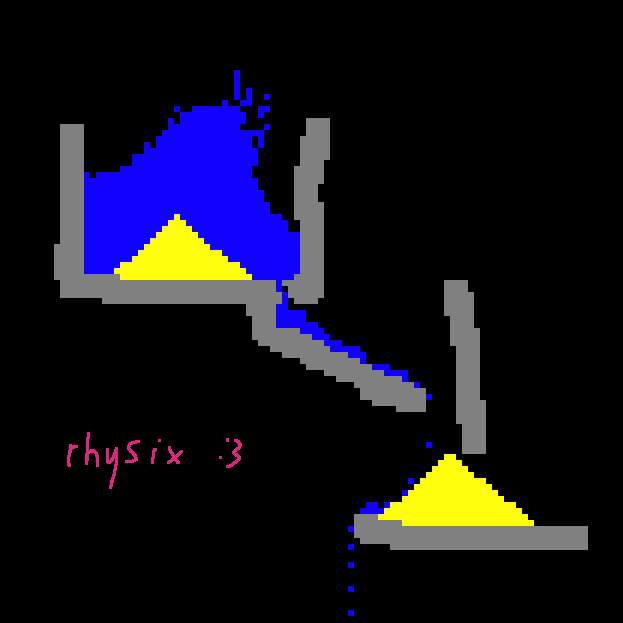

# rhysix
Small sandbox-like physics engine in Rust using [raylib](https://crates.io/crates/raylib).

## Playing
- Change the material used using number keys or by hovering over over the right side of the window to bring up a material selection panel.
- Place using left mouse button and erase using right mouse button.
- Use scroll wheel or + and - to change hand size.
- Press spacebar to toggle pause.
- If you want to place things under the panel, click the right button once to hide it until you take your mouse from it.

## Building
Requirements: **rust**.  
Tested Linux native build and Windows by Wine.  
To build, use `cargo build --release`.
Or download a binary from [Releases](https://github.com/itzreversee/rhysix/releases) page or [Actions](https://github.com/itzreversee/rhysix/actions) tab

## Quirks
- When quickly dragging mouse while placing, there may be missing spots due to ticks being delayed.